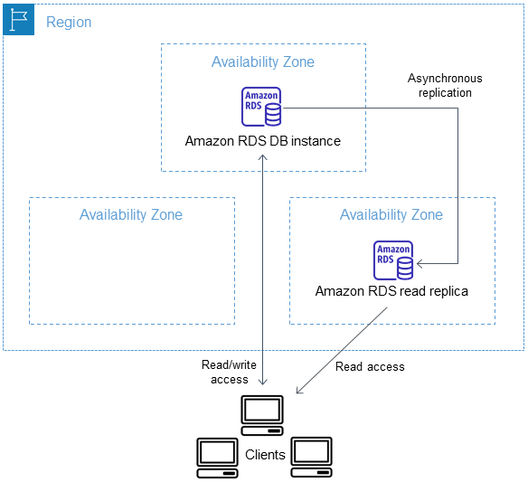

# DB instance with read replica

<!-- BEGINNING OF PRE-COMMIT-TERRAFORM DOCS HOOK -->
## Requirements

| Name | Version |
|------|---------|
|  [terraform](#requirement\_terraform) | >= 1.0.0 |
|  [aws](#requirement\_aws) | >= 5.0.0 |

## Providers

| Name | Version |
|------|---------|
|  [aws](#provider\_aws) | 5.15.0 |

## Modules

| Name | Source | Version |
|------|--------|---------|
|  [primary\_db](#module\_primary\_db) | ../../ | n/a |
|  [replica\_db](#module\_replica\_db) | ../../ | n/a |
|  [vpc](#module\_vpc) | shamimice03/vpc/aws | n/a |

## Resources

| Name | Type |
|------|------|
| [aws_security_group.rds_security_group](https://registry.terraform.io/providers/hashicorp/aws/latest/docs/resources/security_group) | resource |

## Inputs

No inputs.

## Outputs

| Name | Description |
|------|-------------|
|  [db\_instance\_password](#output\_db\_instance\_password) | The database password (this password might be old, because Terraform will not track password after initial creation) |
|  [db\_instance\_username](#output\_db\_instance\_username) | The master username of the DB database |
|  [db\_name](#output\_db\_name) | Name of the initial database |
|  [primary\_db\_address](#output\_primary\_db\_address) | The hostname of the primary db instance |
|  [primary\_db\_availability\_zone](#output\_primary\_db\_availability\_zone) | The availability zone of the primary DB instance |
|  [primary\_db\_class](#output\_primary\_db\_class) | The instance class of the primary DB instance. |
|  [primary\_db\_endpoint](#output\_primary\_db\_endpoint) | The connection endpoint of primary db in `address:port` format |
|  [primary\_db\_engine](#output\_primary\_db\_engine) | The name of the database engine to be used for primary DB instance. |
|  [primary\_db\_engine\_version](#output\_primary\_db\_engine\_version) | The version of the database engine to be used for the primary DB instance. |
|  [primary\_db\_identifier](#output\_primary\_db\_identifier) | The unique identifier for the primary DB instance |
|  [primary\_db\_port](#output\_primary\_db\_port) | The port number on which the primary DB instance accepts connections. |
|  [replica\_db\_address](#output\_replica\_db\_address) | The hostname of the replica db instance |
|  [replica\_db\_availability\_zone](#output\_replica\_db\_availability\_zone) | The availability zone of the replica DB instance. |
|  [replica\_db\_class](#output\_replica\_db\_class) | The instance class of the replica DB instance. |
|  [replica\_db\_endpoint](#output\_replica\_db\_endpoint) | The connection endpoint of replica db in `address:port` format |
|  [replica\_db\_engine](#output\_replica\_db\_engine) | The name of the database engine to be used for replica DB instance. |
|  [replica\_db\_engine\_version](#output\_replica\_db\_engine\_version) | The version of the database engine to be used for the replica DB instance. |
|  [replica\_db\_identifier](#output\_replica\_db\_identifier) | The unique identifier for the replica DB instance |
|  [replica\_db\_port](#output\_replica\_db\_port) | The port number on which the replica DB instance accepts connections. |
<!-- END OF PRE-COMMIT-TERRAFORM DOCS HOOK -->
